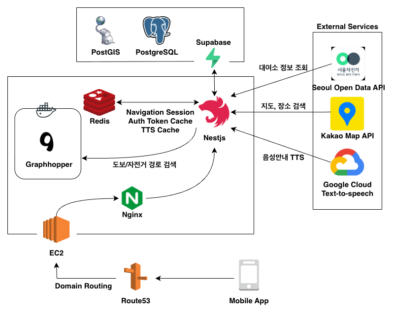

<div align="center">
  

# 따릉이맵 (Ddareungi Map)

따릉이 전용 길찾기 네비게이션 서비스
</div>

---

## 프로젝트 정보

- 팀: TEAM CLU  
- 목적: 서울 공공자전거 따릉이 이용 시, 대여소 조회부터 도보-자전거-도보 통합 경로 탐색과 주행 안내 네비게이션을 제공
- 기간: 2025.08 ~ 2026.02  

---

## 배포 주소

- 서비스 주소: (추가 예정)  

---

## 팀 소개

| 이름 | 역할 | GitHub |
| --- | --- | --- |
| 조유찬 | 프론트엔드 | https://github.com/letYuchan |
| 박수진 | 프론트엔드 | https://github.com/ssuzn |
| 정다운 | 백엔드 | https://github.com/JeongDowny |
| 배재훈 | 백엔드 | https://github.com/LightPlu |

---

## 프로젝트 소개

따릉이맵은 서울 공공자전거 따릉이 이용 시 발생하는 길찾기 불편을 해결하기 위해 개발한 서비스입니다.

기존 따릉이 앱은 대여소 위치만 제공하고, 실제 이용 흐름인  
도보 → 자전거 → 도보 이동을 하나의 경로로 안내하지 않습니다.

사용자는 대여소를 찾고, 다시 자전거 경로를 따로 탐색해야 하는 불편이 존재합니다.

따릉이맵은 이러한 문제를 해결하기 위해  
도보, 자전거 이동을 하나의 경로로 통합하여 제공하는 네비게이션 서비스입니다.

---

## 미리보기

| 대여소 지도 | 경로 안내 | 네비게이션 | 마이페이지 |
| :---: | :---: | :---: | :---: |
|  |  |  |  |

---

## 시작 가이드

### 요구 사항

- Node.js 23.11.0  
- pnpm 10.2.1  
- Redis 실행 필요  
- GraphHopper 실행 필요  

### 설치

```bash
pnpm install
```

### 실행

```bash
pnpm run start:dev
```

### 환경 변수 (.env.local)

```env
NODE_ENV=local

# DB
DB_HOST=
DB_PORT=
DB_DATABASE=
DB_USERNAME=
DB_PASSWORD=

# JWT
JWT_SECRET=
JWT_EXPIRATION_TIME=3600s
ADMIN_API_TOKEN=

# OAuth
GOOGLE_CLIENT_ID=
GOOGLE_CLIENT_SECRET=
GOOGLE_CALLBACK_URL=
GOOGLE_PKCE_CALLBACK_URL=

KAKAO_CLIENT_ID=
KAKAO_CLIENT_SECRET=
KAKAO_CALLBACK_URL=
KAKAO_PKCE_CALLBACK_URL=

NAVER_CLIENT_ID=
NAVER_CLIENT_SECRET=
NAVER_CALLBACK_URL=
NAVER_PKCE_CALLBACK_URL=

# Email
MAIL_USER=
MAIL_PASS=

# External API
SEOUL_OPEN_API_KEY=
KAKAO_MAP_API=

# Redis / Graphhopper
REDIS_HOST=localhost
REDIS_PORT=6379
GRAPHHOPPER_URL=

# TTS
GOOGLE_APPLICATION_CREDENTIALS=

# Supabase storage
SUPABASE_URL=
SUPABASE_SECRET_KEY=
```

---

## 기술 스택

### Backend


### Database / Cache / Storage


### Infra / Routing


### External


### Auth


---

## API 문서

Swagger 문서:
- https://ddareungimap.com/api-docs

이 프로젝트의 API는 Swagger를 통해 확인할 수 있습니다.  
상세한 요청/응답 스펙, 파라미터, 인증 방식은 Swagger 문서를 기준으로 제공합니다.

참고:
- Swagger는 관리자용 Basic Auth가 설정된 경우에만 접근할 수 있습니다.
- 실제 서비스에서 제공하는 주요 기능은 아래 도메인으로 구성되어 있습니다.

### 주요 API 도메인

- `stations`
  - 따릉이 대여소 조회, 지도 반경 조회, 실시간 동기화 관련 API
- `routes`
  - 출발지/도착지 기반 경로 탐색, 순환형 경로 탐색 API
- `navigation`
  - 네비게이션 세션 시작, heartbeat, 복귀 경로 탐색, 재탐색, 세션 종료 API
- `auth`
  - 이메일 인증, 비밀번호 재설정, Google/Kakao/Naver OAuth 및 PKCE 로그인 API
- `user`
  - 회원가입, 로그인, 회원 정보 조회/수정, 비밀번호 변경, 탈퇴 API
- `locations`
  - 키워드 검색, 주소 검색, 좌표-주소 변환 API
- `tts`
  - 음성 안내 생성, 고정 메시지 TTS 생성, 캐시 조회 API


---

## 주요 기능

### 1. 대여소 조회 및 실시간 동기화
- 현재 위치 기반 대여소 조회
- 공공 API 기반 실시간 동기화
- 자전거 보유 여부 확인

### 2. 통합 경로 탐색
- 도보 → 자전거 → 도보 통합 경로 제공
- GraphHopper 기반 경로 계산
- 대여소 포함 경로 탐색

### 3. 주행 네비게이션 및 TTS
- 턴 바이 턴 음성 안내
- Phrase Chunk 기반 TTS 캐싱 구조

### 4. 인증 및 사용자 기능
- OAuth PKCE 로그인 (Google, Kakao, Naver)
- 이메일 인증
- JWT 기반 인증

---

## 아키텍처



### 구성 설명

- NestJS 서버가 전체 API 및 비즈니스 로직 담당
- Supabase(PostgreSQL + PostGIS)로 위치 데이터 관리
- Redis로 세션, 인증, TTS 캐싱 처리
- GraphHopper로 도보/자전거 경로 계산
- 외부 API (서울 공공자전거, Kakao Map, Google TTS) 연동
- EC2 + Nginx 기반 배포

---

## 디렉토리 구조

```bash
src/
├── auth/
├── common/
├── location/
├── mail/
├── navigation/
├── routes/
├── stations/
├── tts/
└── user/
```

---

## 트러블슈팅 및 성능 개선

### 외부 API 병목 해결

- 기존: 대여소마다 외부 API 호출 → 최대 40초 지연  
- 개선: 조회와 동기화 분리 + Redis Lock 적용  
- 결과:
  - 40초 → 42ms
  - API 호출 18% 감소  

### TTS 최적화

- 기존: 전체 문장 단위 TTS  
- 개선: Phrase Chunk 단위 분리  
- 결과:
  - TTS 처리량 약 28% 감소  
